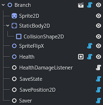
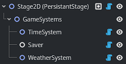

# GDSave

Save System for the Godot Game Engine.

<div style="margin-left: 1em;">

</div>

## Video Tutorial

<div align="center">
  <a href="https://www.youtube.com/watch?v=rcLW2qsLOCQ">
    
  </a>
</div>

## Overview

Entity Component based Save System that supports automatic or manual saving and loading of instanced and static scenes and resources. Allows for basic saving without the need for programming. Designed to provide all features needed for a wide variety of games.

## Features

1. Configurable Save Directory
2. Configurable Name and Extension of Saved Files
3. Supports Custom Separate SaveGame and MetaData Files
4. Custom Game Startup Slot Loading Behaviour
5. Backup of Save Files and Corruption Handling Options
6. Supports Save File Types: Json & Binary
7. Toggle-able File Encryption
8. Toggle-able Json Serializer Options
9. Automatic Saving Options (SaveOnExit, SaveOnSlotSwitch, SaveOnInterval)
10. Configurable Spawn Throttling
11. Configurable Save and Load Hotkeys
12. Time Played Tracking
13. And some other stuff

## Requirements

1. Godot .NET v4.4+
2. .NET 8+
3. Download my GDEssentials repository and follow the setup instructions to use my StageManager. Using Git submodule:
```
git submodule add -b master https://github.com/dxdesjardins/GDEssentials addons/GDEssentials
```

## Setup

1. Install .NET 8+ and Godot .NET v4.4+.
2. Download my GDEssentials repository and add it to your project. Follow the setup instructions in the repository to setup my `StageManager`.
3. Download this GDSave repository and add it to your project's "addons" folder. Using Git submodule:
```
git submodule add -b main https://github.com/dxdesjardins/GDSave.git addons/GDSave
```
4. Set the `SaveManager` as an AutoLoad.
5. Create a `SaveSettings` resource. Open the resource and click the button: `UpdateResourceUid`. This resource controls the settings of the system.

## Usage

### Setup of a Saveable Scene

1. All saveable scenes require a `Saver` node.
2. All saveable nodes must be `[Tool]` scripts. Saveable nodes in this example are `SpriteFlipX`, `Health`, `SaveState`, and `SavePosition2D`.
3. `SaveState` and `SavePosition2D` are included in this repository. `SaveState` will save if its parent is inside the SceneTree. `SavePosition2D` will save its parent's 2D position.
4. If the saveable scene is part of a stage, you must set `Editable Children` to true.

<div style="margin-left: 1em;">
<br>
</div>

### Setup of a Stage with Saveable Nodes

In the below setup, `TimeSystem` and `WeatherSystem` are saveable nodes. A `Saver` node is required to be either a parent or sibling of the saveable nodes for saving and loading to take place. By default, the `Saver` will load all saveables after its parent calls `_Ready`. This may be changed in the `Saver` node settings. All stages must have a root node of type `IStage`, which would be `Stage2D` in this example.

<div style="margin-left: 1em;">
    <br>
</div>

### Spawning a Saveable Scene

If you do not spawn a saved scene through the `SaveManager`, it will not save by default.

<div style="margin-left: 1em;">

```csharp
// Saved scene will be added to the current active stage, determined by the StageManager
SaveManager.SpawnSavedScene(packedScene);

// Configuring a saved scene child component before adding it to the tree.
Node scene = SaveManager.SpawnSavedScene(packedScene, addToTree : false)
scene.GetComponent<Component>().Configure(/* Do configuration here */);
parentStage.AddChild(scene);

// Other use examples:
SaveManager.SpawnSavedScene(packedScene, addToTree : true, stage : customStage, tag : customTag)
SaveManager.SpawnSavedScene(uidString);
```
</div>

### Implementation of a Node that will save and load its parent's position

<div style="margin-left: 1em;">

```csharp
[Tool]
public partial class SavePosition2D : Node, ISaveable
{
    [Export] public string SaveableId { get; set; }
    public Vector2 savedPosition = Vector2.Inf;

    public void OnLoad(string data) {
        var position = GDS.Deserialize<Vector2>(data);
        Node parent = this.GetParent();
        if (parent is Node2D node2D) {
            node2D.Position = position;
            // We set the position twice if the object is a physics body to prevent it from being reverted during the physics process.
            if (parent is PhysicsBody2D physicsBody2D)
                _ = GDE.CallDeferredPhysics(() => { physicsBody2D.Position = position; });
        }
        else if (parent is Control control)
            control.Position = position;
        savedPosition = position;
    }

    public string OnSave() {
        Node parent = this.GetParent();
        if (parent is Node2D node2D)
            savedPosition = node2D.Position;
        else if (parent is Control control)
            savedPosition = control.Position;
        return GDS.Serialize(savedPosition);
    }

    public bool OnSaveCondition() {
        Node parent = this.GetParent();
        if (parent is Node2D node2D)
            return savedPosition != node2D.Position;
        else if (parent is Control control)
            return savedPosition != control.Position;
        return false;
    }
}
```
</div>

### Implementing Saving in an Inventory Node:

<div style="margin-left: 1em;">

```csharp
[Tool]
public partial class Inventory : Node, ISaveable
{
    /// Non-Saving Related Inventory Functionality Hidden
    [Export] public string SaveableId { get; set; }

    public struct SlotSaveData {
        public int Index { get; set; }
        public string ItemUid { get; set; }
        public int Amount { get; set; }
    }

    public struct InventorySaveData {
        public int InventorySize { get; set; }
        public SlotSaveData[] SavedItems { get; set; }
    }

    public string OnSave() {
        InventorySaveData inventorySaveData = new() {
            InventorySize = inventorySize,
            SavedItems = new SlotSaveData[items.Count]
        };
        foreach (KeyValuePair<int, InventoryItem> item in items) {
            inventorySaveData.SavedItems[i] = new SlotSaveData() {
                Index = item.Key,
                ItemUid = item.Value.Data.GetUidToText(),
                Amount = item.Value.Amount,
            };
        }
        return GDS.Serialize(inventorySaveData);
    }

    public void OnLoad(string data) {
        InventorySaveData inventorySaveData = GDS.Deserialize<InventorySaveData>(data);
        inventorySize = inventorySaveData.InventorySize;
        if (inventorySaveData.SavedItems == null)
            return;
        if (inventorySaveData.SavedItems.Length != 0) {
            for (int i = 0; i < inventorySaveData.SavedItems.Length; i++) {
                SlotSaveData getSave = inventorySaveData.SavedItems[i];
                if (GDE.UidToResource<ItemData>(getSave.ItemUid) is ItemData itemData)
                    AddItem(itemData, getSave.Amount, getSave.Index, false);
            }
        }
    }

    public bool OnSaveCondition() {
        return true;
    }
```
</div>

### Implementing Saving in a Resource:

<div style="margin-left: 1em;">

```csharp
[GlobalClass] [Tool]
public partial class ItemEnergy : SaveableResource
{
    [Export] public float min = 0;
    [Export] public float max = 100;
    [Export] public float current = 100;

    public struct SaveData {
        public float Current { get; set; }
    }

    public override string OnSave() {
        return GDS.Serialize(new SaveData() { Current = this.current });
    }

    public override void OnLoad(string saveData) {
        if (string.IsNullOrEmpty(saveData)) {
            // If no data exists, set the default value.
            current = 100;
            return;
        }
        current = GDS.Deserialize<SaveData>(saveData).Current;
    }

    public override void OnSaveCondition() {
        return true;
    }
}
```
</div>

## Relevant Engine Issues

1. Godot structs are not serializable by default using System.Text.Json due to storing data in fields, rather than properties. By default, this project sets the `IncludeFields` JsonSerializerOption to true. If you toggle `IncludeFields` to false, you must write a `JsonConverter` for each Godot struct your want to serialize. This project comes configured with several commonly used struct JsonConverters (Vector2, Vector3, Color). View the engine issue:
https://github.com/godotengine/godot-proposals/issues/8335.
2. Each saveable scene must have a `Saver` node exposed for serialization. The Godot Engine has no easy way to declare non-root nested scene nodes as serializable. This means that nested saved scenes must either have the root node be a `Saver` or you must set `Editable Children` as true. View a pull request that could fix this issue: https://github.com/godotengine/godot/pull/84018.
3. All objects that are to be saved using this system must `[Export]` a SaveableId. This is currently required because the engine has no implementation of unique node ids. View a pull request that could fix this issue: https://github.com/godotengine/godot/pull/86960.
4. Engine PackedScene MetaData is currently broken. The project uses a few inefficient methods of getting scene data that would be greatly improved if this was fixed. View the issue report: https://github.com/godotengine/godot/pull/82532.

## Credit

This project is made in collaboration with Alex Meesters (aka Lowscope) and references original work from his Unity Engine Component Save System.

Check out his feature-similar Unity Engine plugin at:</br>
https://assetstore.unity.com/packages/tools/utilities/component-save-system-159191
